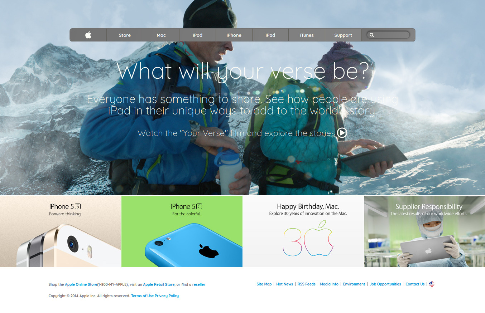

# Project Name

> A clone of apple.com (old)

The goal of this project was to create a similar design to the site (https://web.archive.org/web/20140301004610/http://www.apple.com/) with more emphasis on the use of backgrounds and gradients.

## Built With

- HTML
- CSS

## Authors

👤 **Author1**

- Email: [@gmail](pragatheshpragathesh@gmail.com)
- Github: [@githubhandle](https://github.com/pragatheeshuidev)
- Linkedin: [linkedin](https://www.linkedin.com/in/pragatheesh-r/)

## Show your support

Give a ⭐️ if you like this project!

